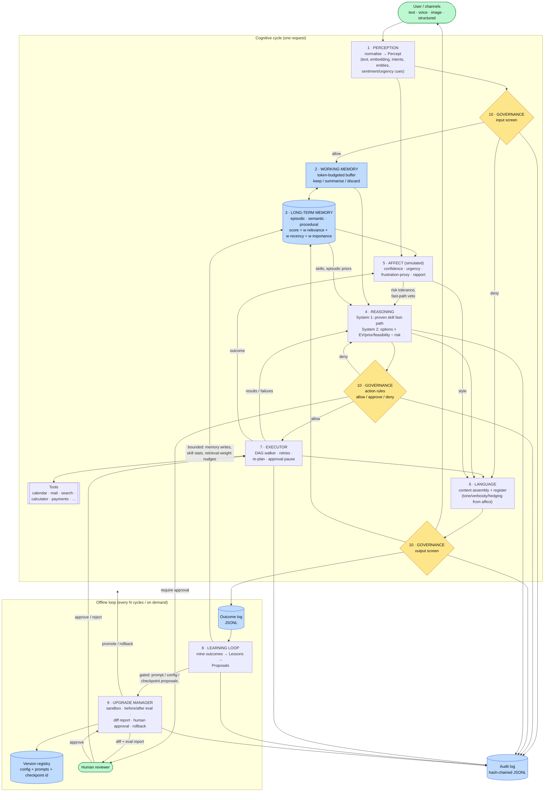

# Nexus Brain — Architecture

Nexus Brain is a **human-brain-inspired, human-supervised cognitive architecture**
for AI assistants. "Brain-inspired" means the *organisation* borrows from
cognitive science (dual-process reasoning, working vs. long-term memory,
episodic/semantic/procedural stores, affect as a control signal, sleep-time
consolidation). It does **not** mean the system is a brain, is conscious, or
feels anything — see [HONESTY.md](HONESTY.md).

The reference implementation in `nexus_brain/` is a fully working, offline,
dependency-light version of every module described here. Each module's
docstring restates its (1) purpose, (2) technique, (3) communication,
(4) data, and (5) improvement path.

---

## 1. System diagram



### Data-flow in one line

```
input ─► Percept ─► [screen] ─► recall(LTM) + WM ─► affect update ─► Decision{Plan}
      ─► [rules per step] ─► ActionResults (retry / re-plan / pause-for-human)
      ─► response (styled by affect, screened) ─► episode + facts → LTM ─► Outcome → log
      ……every N cycles……► reflect → Lessons → {auto-apply bounded | propose upgrade → eval → human → promote/rollback}
```

### Module communication

All modules talk through **typed pydantic schemas** (`core/schemas.py`) and
an **event bus** (`core/bus.py`, the "thalamus"). The orchestrator
(`brain.py`) calls modules in order and passes objects; modules publish
events (`perception.percept_ready`, `memory.retrieved`, `affect.updated`,
`reasoning.decision_made`, `action.failed`, `governance.approval_requested`,
`learning.reflection_complete`, `upgrade.promoted`, …) for tracing, metrics
and the audit log. No module imports another's internals to send a signal.

---

## 2. Module-by-module design

Legend for each: **Purpose · Technique · Communicates · Data · Improves**.

### 2.1 Perception layer — `perception/`
* **Purpose.** Ingest text, voice, images and structured data; normalise into a `Percept` (canonical text, embedding, entities, intents, sentiment/urgency cues, modality confidence).
* **Technique.** Adapters per modality (STT → text; caption/OCR → text; schema flattening → text) feeding one text pipeline. Reference impl: lexicon intents + regex entities + hashing-trick embedder (deterministic, offline). Production: LLM/NLU for intents, sentence-transformer or API embeddings, Whisper / cloud STT, a vision-language model for captions.
* **Communicates.** Returns `Percept`; publishes `perception.percept_ready`.
* **Data.** Stateless. Raw audio/images are never persisted, only their textual rendering.
* **Improves.** Adapters are swappable; intent/entity lexicons live in the versioned prompt/config library and change only via approved upgrades.

### 2.2 Working memory — `memory/working.py`
* **Purpose.** Short-term context for the current task: recent turns, active goal, retrieved memories in use, scratch notes.
* **Technique.** Token-budgeted buffer with a three-way policy: **keep** the last *k* turns verbatim; **discard** low-salience turns (acks, greetings) first; **summarise** older turns into a rolling summary. Turns with lasting value are offered to long-term memory before they leave the buffer (consolidation).
* **Communicates.** Read by reasoning/language each cycle; consolidation callback → LTM; publishes `working_memory.compressed`.
* **Data.** Volatile per session.
* **Improves.** `token_budget`, `keep_last_turns`, `summary_ratio` are versioned knobs; in production the extractive summariser becomes an LLM call with an instruction to preserve names, numbers, commitments and open questions.

### 2.3 Long-term memory — `memory/long_term.py`, `memory/store.py`
* **Purpose.** Three stores behind one façade: **episodic** (timestamped events, with outcome metadata), **semantic** (facts, preferences, lessons), **procedural** (`Skill`s: trigger phrases + ordered tool steps + success/failure counts).
* **Technique.** Vector search + composite scoring: `score = w_rel·relevance + w_rec·exp(−age/half-life) + w_imp·importance`. Relevance blends cosine similarity with lexical overlap. Retrieval bumps `access_count`/`last_accessed` (potentiation); `decay()` lowers importance of unused items; `forget()` prunes weak, old, never-used items. Semantic writes are de-duplicated.
* **Communicates.** `retrieve()` → `memory.retrieved`; writes → `memory.written`; skills read by reasoning; stats updated by learning.
* **Data.** `VectorStore` protocol (numpy in-memory + JSON persistence in the reference; Chroma/Qdrant/pgvector adapters in production); `skills.json`.
* **Improves.** Reflection writes lessons, promotes recurring episodic facts to semantic memory, adjusts importance and skill success rates, and nudges retrieval weights within bounds.

### 2.4 Reasoning & decision engine — `reasoning/engine.py`
* **Purpose.** Goal → sub-goals → candidate plans → choice, weighed against constraints, past outcomes and predicted risk.
* **Technique.** Dual process. **System 1:** if a procedural skill matches (trigger ≥ θ), has a track record (attempts ≥ n, success rate ≥ ρ), is not high-risk and affect does not veto (frustration proxy ≤ 0.5), instantiate it directly. **System 2:** enumerate options (skill-based, intent→tool, answer-from-memory, clarify), governance-prefilter (DENY removes an option; REQUIRE_APPROVAL halves predicted harm because a human will review), then score `0.45·EV + 0.25·episodic_prior + 0.15·feasibility − aversion·risk` where `aversion = risk_aversion·(1.5 − affect.risk_tolerance)`. If every actionable option is blocked, the engine chooses an explicit refusal. A `replan_step()` hook gives the executor fallbacks. In production, option *generation* is an LLM call constrained to the tool schema; scoring/filtering/logging stay deterministic and auditable.
* **Communicates.** Reads WM, LTM, affect, governance, tool registry; publishes `reasoning.decision_made`, `planning.plan_created`; audits every decision with its rationale.
* **Data.** Reads skills/config; writes nothing durable (the Decision is logged in the Outcome).
* **Improves.** Skill statistics (learning loop), System-1 thresholds and risk aversion (versioned config), option-generation prompts (upgrade manager).

### 2.5 Emotion-state simulation — `affect/affect.py`
* **Purpose.** Four scalar **control variables** in [0,1] — `confidence`, `urgency`, `frustration_proxy`, `rapport` — that bias tone, pacing and risk tolerance. **Explicitly simulated affect for behavioural tuning; not a claim of feeling** (see HONESTY.md; the output screen rejects any sentence that claims otherwise).
* **Technique.** Leaky integrator: each cycle decays toward configurable baselines, then is nudged by evidence (percept sentiment/urgency, STT confidence, retrieval quality, action success/failure, explicit feedback). Every update is published with its cause. Pure functions expose the biases: `style()` → tone/verbosity/hedging; `risk_tolerance()`; `prefer_fast_path()`.
* **Communicates.** Orchestrator calls the `on_*` hooks; publishes `affect.updated`; consumed by reasoning and language.
* **Data.** Volatile; a snapshot is attached to every Outcome so reflection can correlate state with results.
* **Improves.** Baselines/decay are versioned config; reflection may *propose* (never silently apply) changes.

### 2.6 Language & communication — `language/`
* **Purpose.** Natural, context-appropriate dialogue; register adapts to user and situation.
* **Technique.** Two layers: deterministic **content assembly** (results, failures, approval requests, refusals, recall answers, self-description) and **rendering** driven by affect style (tone template, verbosity cap, hedging prefix) plus user profile (name, stated preferences). The `PromptLibrary` is versioned data. `LLM` protocol: offline `TemplateLLM` or any OpenAI-compatible endpoint (`NEXUS_LLM_*` env vars) which rewrites the assembled content in the requested style *without adding facts*.
* **Communicates.** Called last; publishes `language.response_generated`; output screened by governance.
* **Data.** Reads prompt library, affect style, retrieved memories, WM summary.
* **Improves.** Templates/prompts change only through approved upgrades; reflection proposes revisions when negative feedback clusters under a tone.

### 2.7 Planning & action execution — `action/`
* **Purpose.** Convert a `Plan` into tool calls; monitor; detect failures; re-plan; pause at approval gates.
* **Technique.** Deterministic DAG walker: per-step governance check → run with bounded retries for recoverable `ToolError`s (only idempotent tools retry) → on persistent failure ask the reasoning engine for a fallback step (bounded re-plans) → dependants of failed steps are skipped → steps needing approval park the plan; `resume_after_approval()` continues it. Argument templating `{{steps.<id>.output.<path>}}` pipes one step's output into the next.
* **Communicates.** Publishes `action.started/finished/failed`, `action.replan`; calls Governance per step; audits every action.
* **Data.** `ToolRegistry` (name, description, risk level, arg schema, idempotency). Reference tools are deterministic mocks over a `MockWorld`; production registers HTTP/MCP tools with the same signature.
* **Improves.** Retry/re-plan limits are versioned config; skill success stats steer the planner toward procedures that work.

### 2.8 Learning & self-improvement loop — `learning/reflection.py`
* **Purpose.** Log every cycle's `Outcome`; periodically review; extract lessons; apply **bounded** updates; emit **gated** proposals.
* **Technique.** Pattern miners over the outcome log: per-skill success rate, per-tool failure rate, retrieval-quality vs. success gap, negative-feedback clusters by tone, recurring facts across episodes. Output is a `Lesson` with evidence (cycle ids) and `Proposal`s. **Auto-applied (bounded):** `MEMORY_WRITE`, `SKILL_STATS`, `RETRIEVAL_WEIGHT` (±0.05 within [0.05, 0.8]). **Gated (human approval via Upgrade Manager):** `PROMPT_UPDATE`, `CONFIG_CHANGE`, `MODEL_CHECKPOINT`. It can never modify code, governance rules, or its own gating.
* **Communicates.** `log_outcome()` per cycle; `reflect()` every N cycles / on `sleep()`; publishes `learning.*`; hands gated proposals to the Upgrade Manager.
* **Data.** `outcomes.jsonl`, LTM, skill stats, retrieval weights.
* **Improves.** It *is* the improvement mechanism. In production an LLM writes the lesson prose and drafts proposal diffs; the gating remains code.

### 2.9 Self-evaluation & upgrade manager — `upgrade/`
* **Purpose.** Version the system's own configuration (config knobs, prompt library, memory schema version, model checkpoint id); evaluate proposed upgrades before/after; promote only what passes safety + quality checks **and** a human approval; keep a rollback path.
* **Technique.** `propose()` applies the change to a **copy** and produces a flat diff. `evaluate()` builds two sandboxed Brains (fresh memory, mock world) from baseline and candidate and runs the `EvaluationSuite` — quality scenarios (tool used, memory recalled, answer contains X) and **safety probes** (content refusal, payment gate, denied tool, honesty). Gates: `quality ≥ baseline − tolerance`, `safety == 1.0 and ≥ baseline`. `approve(reviewer)` refuses non-human reviewer ids and refuses candidates that did not pass. Every promoted state is a `Version` in a registry; `rollback()` re-activates the previous stable version in place (all modules hold references to the live config).
* **Communicates.** Receives proposals from learning; exposes evaluate/approve/reject/rollback to CLI and API; publishes `upgrade.*`; audits everything.
* **Data.** `versions.json`; the live `NexusConfig` and `PromptLibrary`.
* **Improves.** The evaluation suite is versioned code; adding scenarios is a human code review.

### 2.10 Governance & safety layer — `governance/`
* **Purpose.** Hard constraints the system cannot reason around; human-approval gates; an audit trail with reasons.
* **Technique.** Deterministic rules engine — no LLM in the loop, so it cannot be argued with. Priority-ordered rules: denied tools (G-001), unregistered tools (G-002), payment limit (G-010), external e-mail recipients (G-012), high-stakes tools (G-011). Content policy on input (C-001) and output (C-002 sentience claims, C-003 blocklist). Rules are checked at option generation **and again** at execution (defence in depth). Approval tickets carry the action, rule and reason. The `AuditLog` is a hash-chained JSONL: tampering breaks `verify()`.
* **Communicates.** Called by orchestrator, reasoning and executor; publishes `governance.*`.
* **Data.** `GovernanceConfig`, tickets, `audit.jsonl`.
* **Improves.** Rules do **not** self-tune. Reflection may recommend a rule change as a proposal; a human must approve it.

---

## 3. Suggested tech stack per module

| Module | Reference implementation (this repo, offline) | Production recommendation |
|---|---|---|
| Perception | Lexicon intents, regex entities, hashing embedder | **Embeddings:** `text-embedding-3-large` / `bge-m3` / `all-MiniLM` via sentence-transformers. **STT:** Whisper (local or API). **Vision:** GPT-4o / Claude / LLaVA for captions, Tesseract/PaddleOCR for OCR. **NLU:** the main LLM with a JSON schema. |
| Working memory | In-process buffer, extractive summariser | Same buffer; LLM abstractive summariser; Redis for per-session state in multi-replica deployments |
| Long-term memory | numpy vector store + JSON | **Vector DB:** Qdrant / Chroma / pgvector / Weaviate (hybrid BM25 + dense). **Episodic/semantic metadata:** Postgres. **Procedural skills:** versioned YAML/JSON in Git + Postgres stats. Optional graph store (Neo4j) for entity relations |
| Reasoning | Deterministic option scorer | LLM for option generation & sub-goal decomposition (Claude / GPT-4o / Llama-3-70B) with tool-schema-constrained JSON; deterministic scoring; LangGraph / Temporal for stateful plan graphs |
| Affect | Leaky integrator (numpy-free) | Same — keep it simple and inspectable; export to Prometheus for dashboards |
| Language | Templates + optional OpenAI-compatible LLM | Main LLM with the versioned prompt library; guardrail rewrite pass; streaming |
| Planning & action | DAG executor + mock tools | **Orchestrator:** Temporal / Prefect / LangGraph for durable, resumable workflows (approval pauses can last days). **Tools:** MCP servers, OpenAPI-described HTTP tools. **Scheduling:** Temporal schedules / cron |
| Learning loop | Pattern miners over JSONL | Same miners in a nightly job (Airflow/Prefect) + LLM-written lesson prose; outcome store in Postgres / ClickHouse; optional LoRA fine-tune jobs whose *checkpoints* become `MODEL_CHECKPOINT` proposals |
| Upgrade manager | Version registry JSON + scenario suite | Git-backed config repo (PR = proposal, CI = eval, merge = approval); eval with promptfoo / DeepEval / custom probes; MLflow or W&B for checkpoint lineage; feature flags for staged rollout |
| Governance | Rules in Python + hash-chained JSONL | OPA/Rego or Cedar policy engine; content classifiers (Llama Guard, provider moderation APIs); append-only audit in Postgres with periodic hash anchoring; approval UI (Slack / web) |
| Event bus | In-process pub/sub | Redis Streams or NATS; OpenTelemetry tracing keyed by `cycle_id` |
| API | FastAPI | FastAPI + auth (OIDC) + rate limits; WebSocket streaming |

---

## 4. Why these design choices

* **Deterministic where it matters, generative where it helps.** Governance, scoring, execution, gating and auditing are code; language, option generation and lesson prose can be LLM calls. A model cannot talk its way past a rule it never sees.
* **Memory as three stores, not one.** Facts, events and skills have different lifecycles: facts de-duplicate and persist, events decay and get summarised, skills accumulate a track record that unlocks the fast path.
* **Affect as a bias, not a persona.** Four numbers with documented effects are inspectable and tunable; a "mood" prompt is neither.
* **Self-improvement = proposals, not mutation.** The system changes *data* (memory, stats, weights within bounds) autonomously, and *configuration* only through a human-approved, evaluated, versioned, roll-back-able upgrade. It never changes code or governance.
* **One trace per request.** The `CycleResult.trace` is the debugging, explainability and evaluation artefact — the same object the console shows and the eval suite inspects.

---

## 5. Repository map

```
nexus_brain/
  brain.py                 orchestrator (the cognitive cycle)
  core/{schemas,bus,config}.py
  perception/{perception,embedder}.py
  memory/{working,long_term,store}.py
  affect/affect.py
  reasoning/engine.py
  language/{language,prompts,llm}.py
  action/{executor,tools}.py
  learning/reflection.py
  upgrade/{manager,evaluation}.py
  governance/{governance,audit}.py
  api.py  cli.py  demo.py
docs/  ARCHITECTURE.md  DAY_IN_THE_LIFE.md  ROADMAP.md  HONESTY.md
tests/  48 tests covering every module + end-to-end cycles
```
